# BioAmp Filter Designer

BioAmp Filter Designer is a Python-based desktop tool that generates ready-to-use digital filters for biomedical signal processing applications such as ECG, EMG, EOG and EEG. Pick a filter type, sampling rate, order and cutoff frequencies, choose a programming language, and the tool writes a complete Butterworth IIR filter class for you, along with an optional frequency response plot.

The generated filter is implemented as cascaded second-order sections (biquads) and comes as a class with `process()` and `reset()` methods, so you can create one object per channel for multi-channel signals.

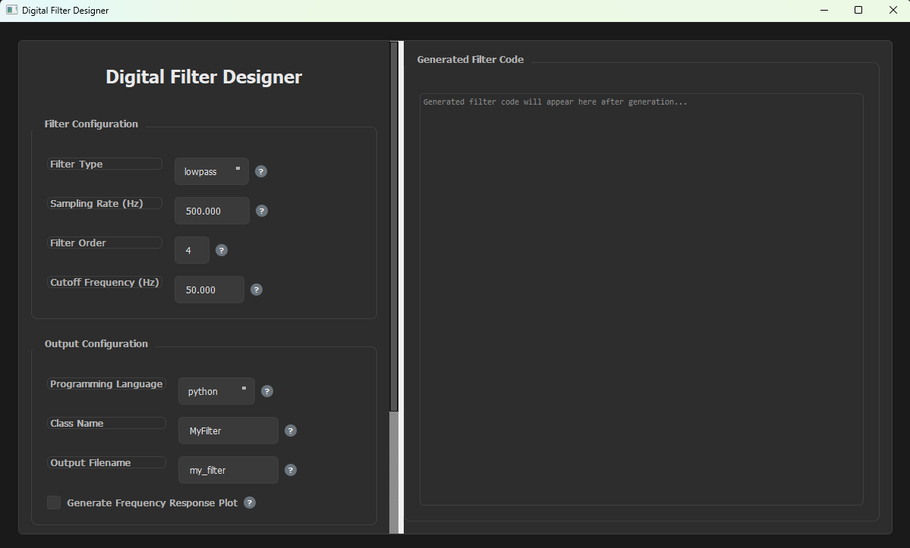

---

## Features

| Feature | Description |
| --- | --- |
| **Four filter types** | Lowpass, highpass, bandpass and bandstop Butterworth filters. |
| **Five output languages** | Generate the filter as Python, JavaScript, TypeScript, C++ or Java code. |
| **Class-based output** | The filter is generated as a class, so multiple objects can be created for multi-channel signals. |
| **Frequency response plot** | Optionally save a frequency response image to check the filter before using it. |
| **Input validation** | Cutoff frequencies are checked against the Nyquist frequency, and the low cutoff must be below the high cutoff. |
| **Built-in help** | Every field has a `?` button that explains what it does. |

---

## Requirements

Before running the application, ensure you have:

- Python 3.8 or higher installed
- pip package manager (comes with Python)
- Supported operating systems: Windows / macOS / Linux

The Python packages the tool needs (`numpy`, `scipy`, `matplotlib` and `PyQt5`) are listed in `requirements.txt` and installed in the setup steps below.

---

## Installation & Setup

Follow the steps below to set up and run BioAmp Filter Designer locally.

### 1. Clone the Repository

```bash
git clone https://github.com/upsidedownlabs/BioAmp-Filter-Designer.git
```

Alternatively, download the repository as a ZIP file: open the repository page on GitHub, click the **Code** button and choose **Download ZIP**, then extract it.

### 2. Open the Project Directory

```bash
cd BioAmp-Filter-Designer
```

If your downloaded folder has extra text in its name (for example `BioAmp-Filter-Designer-main (1)`), make sure to navigate into the correct folder path.

### 3. Create a Virtual Environment

Creating a virtual environment keeps the dependencies isolated from your system Python:

```bash
python -m venv .venv
```

### 4. Activate the Virtual Environment

On Windows (PowerShell):

```powershell
.venv\Scripts\activate
```

On macOS / Linux:

```bash
source .venv/bin/activate
```

Once activated, your terminal prompt shows `(.venv)` at the beginning.

### 5. Install the Dependencies

```bash
pip install -r requirements.txt
```

### 6. Run the Application

```bash
python GUI.py
```

This opens the Digital Filter Designer window.

---

## Usage Guide

The controls are in the left panel, which you can scroll to reach the options at the bottom. The generated filter code appears in the right panel.

### 1. Select the Filter Type

Choose what the filter should do:

- **lowpass** blocks high frequencies and smooths the signal.
- **highpass** blocks low frequencies and removes constant (DC) offsets.
- **bandpass** allows only the frequencies within a range and blocks the rest.
- **bandstop** blocks the frequencies within a range, for example to remove 50 Hz or 60 Hz mains noise.

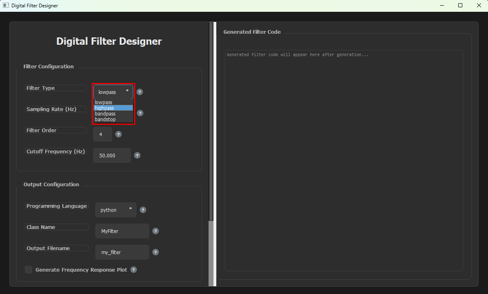

### 2. Enter the Sampling Rate

Enter the rate at which your signal is sampled, in samples per second (Hz). It must be at least twice the highest frequency you care about (the Nyquist theorem), so every cutoff frequency you enter has to be below half of the sampling rate.

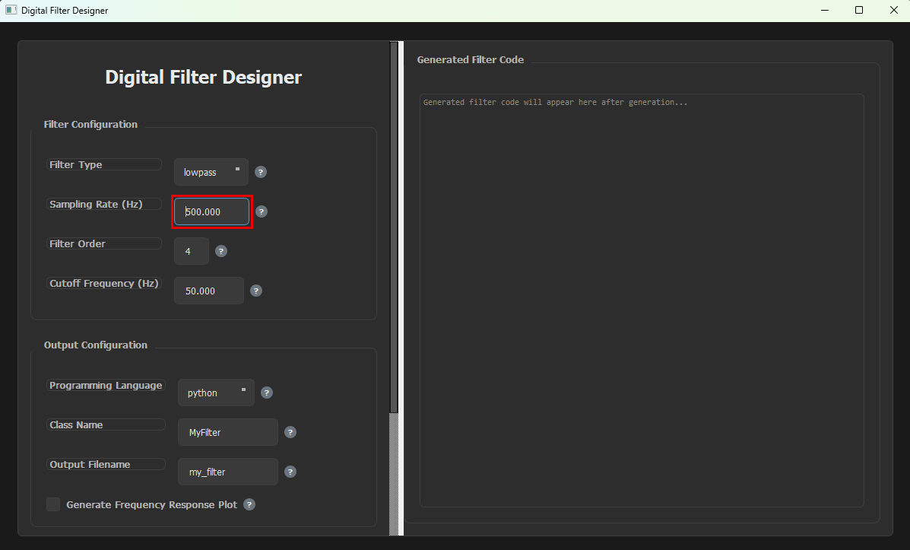

### 3. Select the Filter Order

The filter order sets how steeply the filter cuts off frequencies. A higher order gives a steeper roll-off but needs more computation, and 2 to 8 is typical for most applications.

You can use any whole number from 1 to 20 (the default is 4). It does not have to be even.

> **Note:** For lowpass and highpass filters, the order you enter is the order of the filter. For bandpass and bandstop filters, it applies to each edge of the band, so the resulting filter has twice that order. For example, order 2 gives a 4th-order band filter made of two biquad sections.

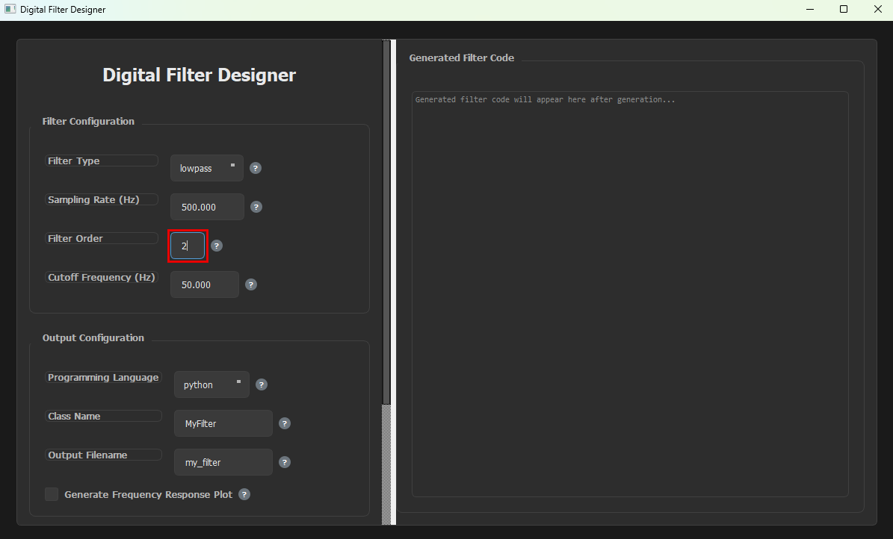

### 4. Enter the Cutoff Frequency

For **lowpass** and **highpass** filters, enter a single cutoff frequency in Hz. A lowpass filter reduces the frequencies above it, and a highpass filter reduces the frequencies below it.

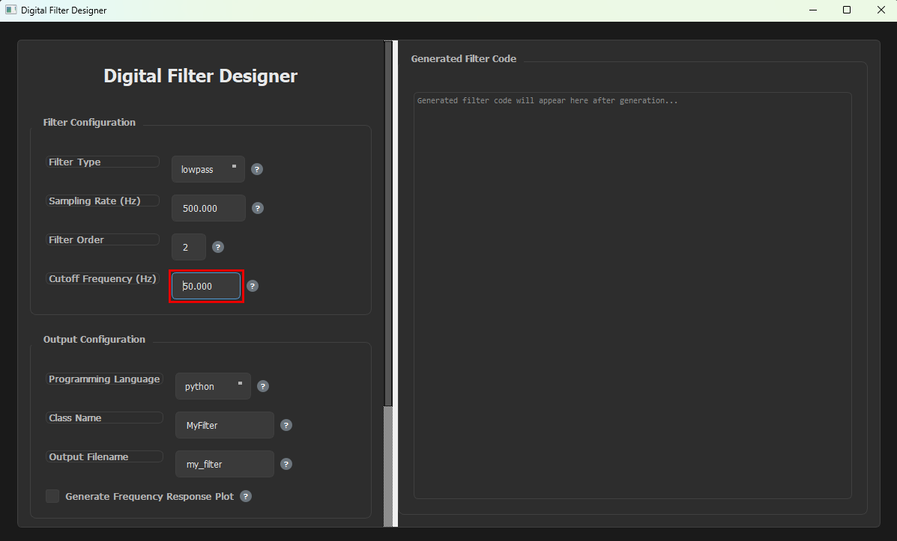

For **bandpass** and **bandstop** filters, two fields appear. Enter the lower edge of the band in **Low Cutoff Freq (Hz)**:

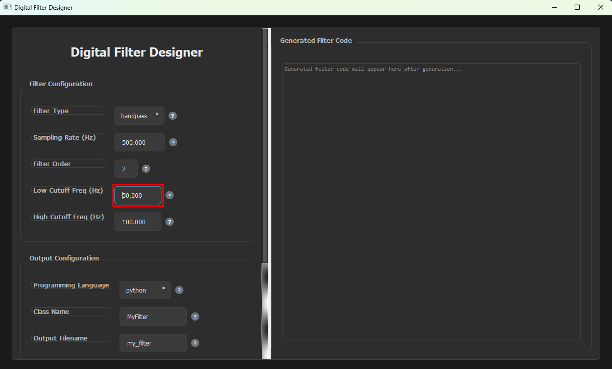

Then enter the upper edge of the band in **High Cutoff Freq (Hz)**:

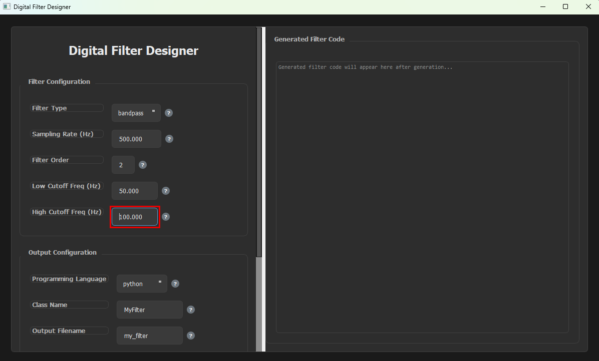

The low cutoff must be below the high cutoff, and both must be below half of the sampling rate.

### 5. Select the Programming Language

Choose the language to generate the filter in: **python**, **javascript**, **typescript**, **c++** or **java**.

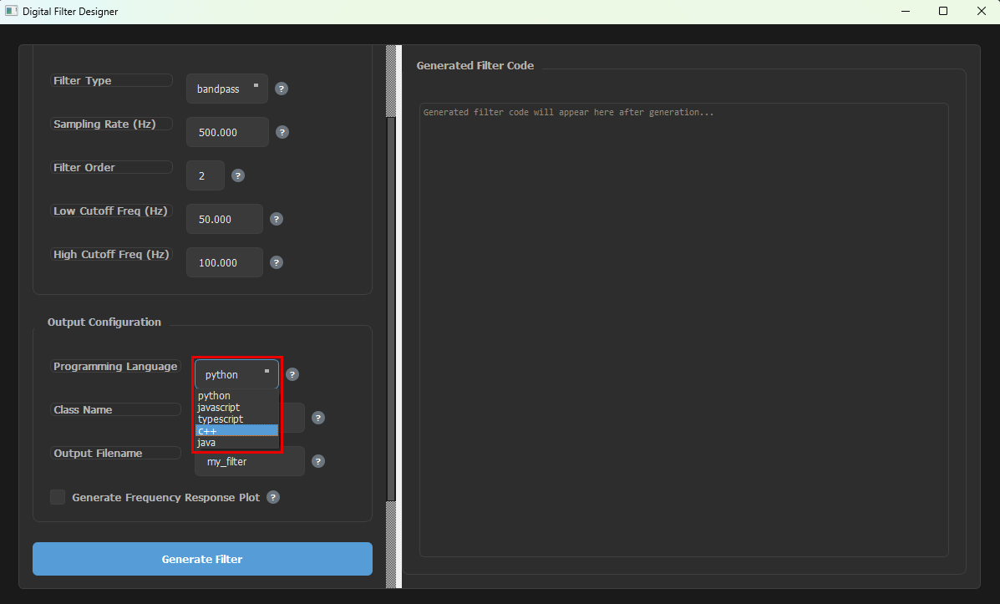

### 6. Enter the Class Name

The filter is generated as a class, so you can create multiple objects from it, one for each channel of your signal. Each object keeps its own filter state. Enter the name you want for the class, for example `EEGFilter`.

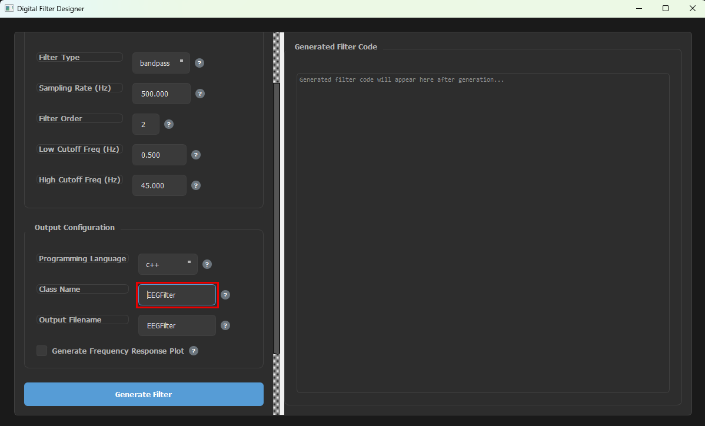

### 7. Enter the Output Filename

Enter the name of the file the filter is saved to. The extension is added automatically based on the language you selected (`.py`, `.js`, `.ts`, `.cpp` or `.java`). The file is saved in the folder you launched the app from, which is the project folder if you followed the steps above.

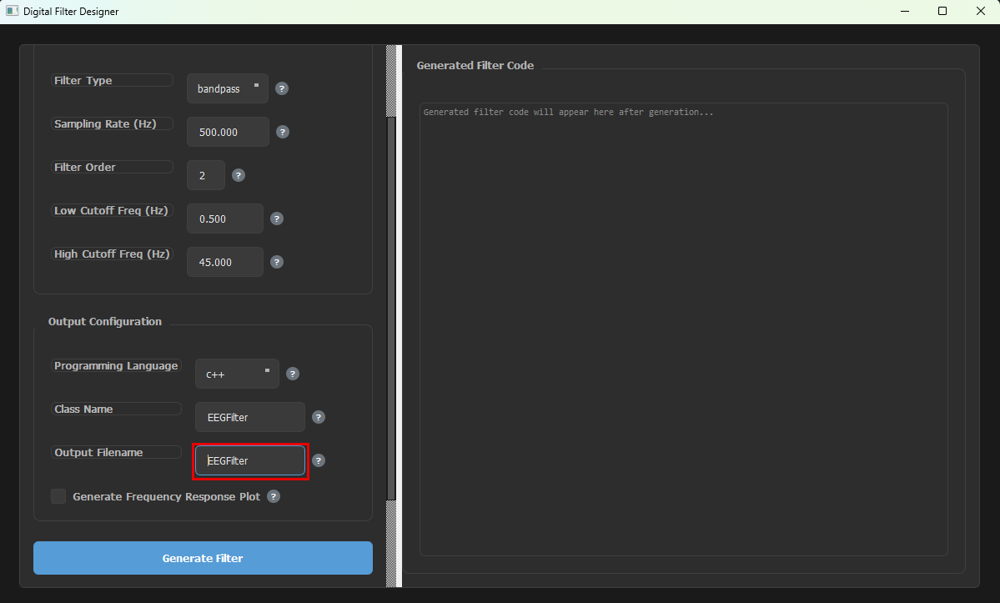

### 8. Enable or Disable the Frequency Response Plot

Use the **Generate Frequency Response Plot** checkbox to choose whether a frequency response image is saved along with the filter. When it is enabled, the plot is saved as `<filename>_response.png` in the same folder as the filter file. Hover over the `?` button next to it for a short description.

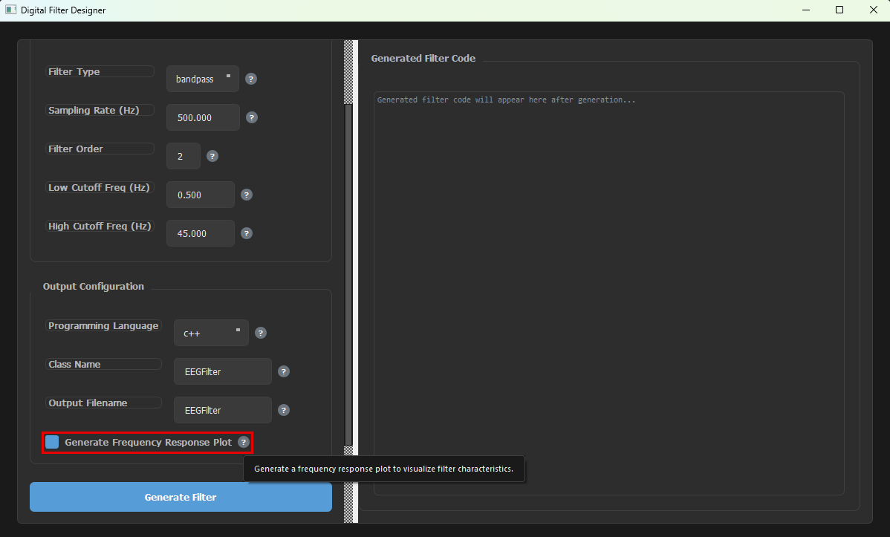

### 9. Generate the Filter

Click **Generate Filter**. The generated code appears in the **Generated Filter Code** panel, the file is saved, and the **Status** box below the button shows what was created.

The code ends with commented-out usage examples for single-channel and multi-channel use. These are only for reference, so you do not need to copy them. To use the filter, select the generated code in the panel and copy it, or use the saved file.

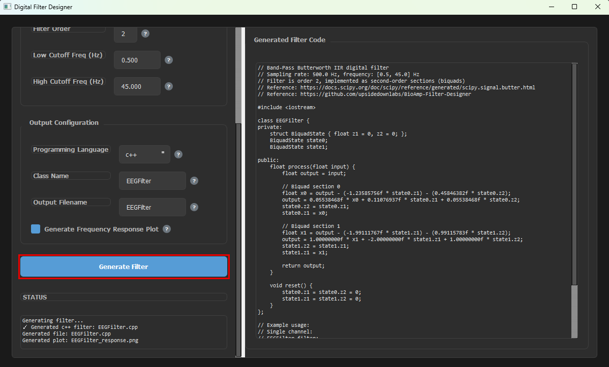
